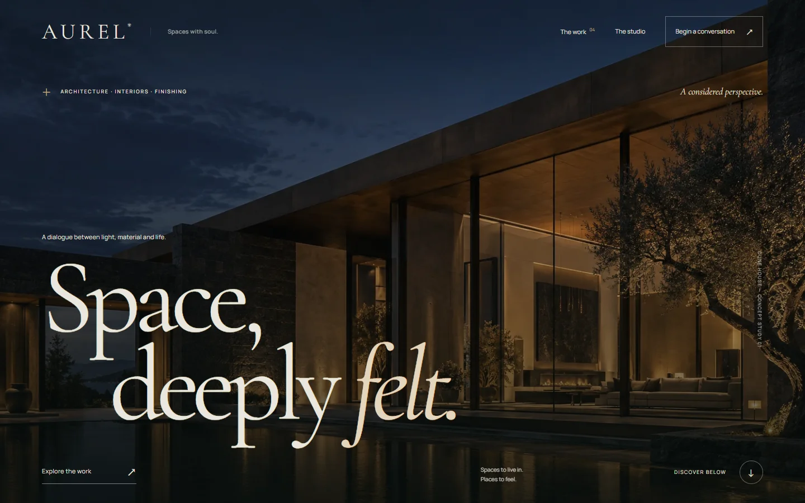

# AUREL — Space, deeply felt.

## Website and source

[Live website](https://18-aurel.williamking.workers.dev) · [Public source](https://github.com/WilliamHenryKing/18-aurel) · [Verification](docs/VERIFICATION.md) · [Release](docs/RELEASE.md)



A cinematic architecture, interiors and finishing portfolio. AUREL is a fictional practice; every named project is a speculative study. The site combines original generated architectural artwork, an original interactive Three.js light pavilion, and one clearly credited licensed photographic reference.

## Run locally

Requires Bun 1.3.10. Dependencies are pinned and installed inside this project.

```sh
bun install --frozen-lockfile
bun run dev
```

Development: `http://127.0.0.1:4528`. Production preview: `http://127.0.0.1:4628`. Both bind only to loopback and use strict ports. The root collection coordinator schedules builds, browser sessions and other heavy work sequentially.

```sh
bun run typecheck
bun run lint
bun run build
bun run preview
```

The user has authorised public GitHub and Cloudflare publication. Root manages publication after visual and interaction QA. `bun run deploy` performs checks and uses the project-local Wrangler configuration; this README alone is not evidence of a live deployment.

## Experience

- Full-bleed twilight hero with a staged GSAP title entrance and restrained scroll parallax.
- Selected studies, discipline filters, and four individual concept stories.
- Interactive pavilion: daylight/dusk, limestone/basalt and five viewing angles. An original model with a reflecting basin, timber screen, stone bench, daybed, split roof, skylight and material detail.
- Studio perspective and three-stage process.
- A local brief builder. The user downloads a text file; no message is sent, no personal details are requested, and there is no backend or tracking.
- Mobile navigation, keyboard focus, skip control, visible motion toggle, reduced-motion default, native scrolling and responsive layouts down to 320px.

## Editing

`src/content.ts` contains the four studies, their image filenames, image disclosures and studio process. Update those records to change titles, categories, descriptions, palettes or photography credits. `src/App.tsx` holds page composition, home/editorial copy, hash routes and the brief builder. `src/styles.css` contains the independent visual system and responsive rules. `src/LightStudy.tsx` owns the pavilion model, materials, lighting, state transitions and lifecycle.

Routes are `#/`, `#/projects`, `#/projects/<slug>`, `#/studio`, `#/enquiry` and `#/light`. Browser back/forward uses native hash history. Unknown routes render a useful 404 view. Static unknown paths use `public/404.html` through Cloudflare.

Fonts and images are served locally. Keep image pairs (`name.webp`, `name-small.webp`) when adding a study; the hero uses `aurel-hero-mobile.webp`. See [ASSETS.md](ASSETS.md) for exact source and licence information, and `tools/asset-manifest.json` for file sizes and SHA-256 hashes.

## Rendering and accessibility

Three.js is a lazy chunk. The renderer uses capped DPR (1.3 below 700px, otherwise 1.65), one shadow-casting directional light, an original procedural stone texture, an instanced screen, and a locally created PMREM environment. Rendering occurs on demand during transitions and stops when settled, offscreen or hidden. Geometries, materials, textures, observers, event listeners, animation frames and the WebGL context are released on route unmount. Unsupported/lost WebGL reveals a CSS pavilion and the same readable material controls.

`window.__AUREL_DIAGNOSTICS__` reports the actual render status, frame count, visibility, motion setting, selected material/hour, DPR, draw calls, triangles, geometries, textures and disposal state. The diagnostic object makes browser inspection possible; it is not a performance certification.

Validation state and outstanding review are recorded in [HANDOFF.md](HANDOFF.md). Design intent is in [DESIGN.md](DESIGN.md).
