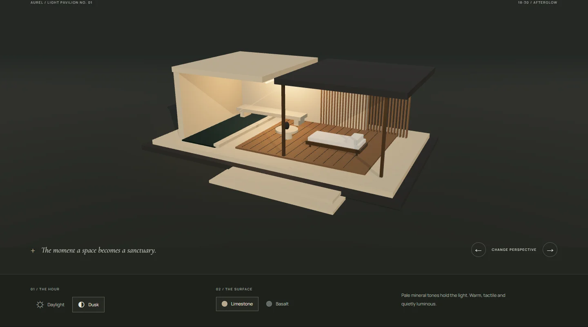

# AUREL — Space, deeply felt.

## Website and source

[Live website](https://18-aurel.williamking.workers.dev) · [Public source](https://github.com/WilliamHenryKing/18-aurel) · [Verification](docs/VERIFICATION.md) · [First release](docs/RELEASE.md)


A cinematic architecture, interiors and finishing portfolio. AUREL is a fictional practice; every named project is a speculative study. The site combines original generated architectural artwork, an original interactive Three.js light pavilion, and one clearly credited licensed photographic reference.

The links, release receipts and captures above record the first public release. The current source adds the refined editorial layout, a two-view architectural render gallery and a cinematic pavilion camera sequence. Final CUDA render delivery, integration and the subsequent build, browser and live-release verification are pending. The earlier release evidence does not verify this revision.

## Run locally

Requires Bun 1.3.10. Dependencies are pinned and installed inside this project.

```sh
bun install --frozen-lockfile
bun run dev
```

Development: `http://127.0.0.1:4528`. Production preview: `http://127.0.0.1:4628`. Both bind only to loopback and use strict ports. The root collection coordinator schedules builds, browser sessions and other heavy work sequentially.

```sh
bun run typecheck
bun run lint
bun run build
bun run preview
```

The user has authorised public GitHub and Cloudflare publication. Root manages publication after visual and interaction QA. `bun run deploy` performs checks and uses the project-local Wrangler configuration; this README alone is not evidence of a live deployment.

## Experience

- Full-bleed twilight hero with a restrained GSAP image settle; an ink aperture reveals the architectural render gallery.
- Selected studies, discipline filters, and four individual concept stories.
- Interactive pavilion: a scroll-driven camera moves from Threshold to Timber screen to Water. Named-view buttons, pause/resume and a skip to material controls provide alternatives to scrolling. Daylight/dusk, limestone/basalt and left/right perspective controls remain available.
- A separate architectural still gallery switches between the inhabited room and its joinery detail. Final local render assets are being delivered under the filenames listed below; this gallery is distinct from the realtime section model.
- Studio perspective and three-stage process.
- A local brief builder. The user downloads a text file; no message is sent, no personal details are requested, and there is no backend or tracking.
- Mobile navigation, keyboard focus, skip control, visible motion toggle, reduced-motion default, native scrolling and responsive layouts down to 320px.

## Editing

`src/content.ts` contains the four studies, their image filenames, image disclosures and studio process. Update those records to change titles, categories, descriptions, palettes or photography credits. `src/App.tsx` holds page composition, home/editorial copy, hash routes and the brief builder. `src/styles.css` contains the independent visual system and responsive rules. `src/LightStudy.tsx` owns the pavilion model, materials, lighting, camera timeline, controls and lifecycle. `src/lightJourney.ts` contains the chapter copy and paired camera/target coordinates; edit the mobile pullback values there when adjusting phone composition. `src/WorldGallery.tsx` owns the separate still-image view selector.

Routes are `#/`, `#/projects`, `#/projects/<slug>`, `#/studio`, `#/enquiry` and `#/light`. Browser back/forward uses native hash history. Unknown routes render a useful 404 view. Static unknown paths use `public/404.html` through Cloudflare.

Fonts and images are served locally. Keep image pairs (`name.webp`, `name-small.webp`) when adding a study; the full-height hero retains its detailed source on phones; smaller gallery variants reduce secondary image transfers. See [ASSETS.md](ASSETS.md) for exact source and licence information, and `tools/asset-manifest.json` for file sizes and SHA-256 hashes.

The render gallery expects `public/images/aurel-world.webp` and `aurel-world-mobile.webp` for the wide room, plus `aurel-timber-study.webp` and `aurel-timber-study-mobile.webp` for the close view. Both compositions use a 16:10 frame. Root will publish final render metadata, editable source and reproduction instructions in [docs/RENDERING.md](docs/RENDERING.md) with the asset package; that document is pending at this source checkpoint.

## Rendering and accessibility

Three.js is a lazy chunk, requested 400px before the reserved pavilion container or immediately for `#/light`. The renderer uses capped DPR (1.3 below 700px, otherwise 1.65), one shadow-casting directional light, an original procedural stone texture, an instanced screen, and a locally created PMREM environment. Rendering occurs on demand during camera/light/material transitions and stops when settled, offscreen or hidden. Geometries, materials, textures, observers, event listeners, animation frames and the WebGL context are released on route unmount. Unsupported/lost WebGL reveals a CSS pavilion and the same readable material notes.

The camera uses paired Three.js Catmull–Rom curves driven by a labelled GSAP timeline and ScrollTrigger (`scrub: 0.55`). One CSS sticky stage has 115svh of camera travel, reduced to 88svh at widths up to 700px; there is no wheel interception or ScrollTrigger pin. ScrollToPlugin handles chapter jumps and the material-controls skip, which transfers keyboard focus. Selecting an hour, surface or perspective gives the visitor camera control until Resume scroll or a named chapter is chosen. Reduced motion, the global motion-off setting and viewports below 600px tall remove the scroll runway while retaining named views. `useGSAP`, `matchMedia` and context-safe event callbacks own and clean up the animation work.

`window.__AUREL_DIAGNOSTICS__` reports actual frame count, visibility, material/hour, DPR, draw calls, triangles, GPU resource counts and disposal state. Camera inspection adds `cameraOwner`, `journeyProgress`, `scrollProgress`, `chapter`, camera/target XYZ arrays, `journeyEnabled`, `scrollStart`, `scrollEnd`, `scrollTriggerActive` and `renderPending`. The diagnostic object supports browser inspection; it is not a performance certification.

Seven official MIT-licensed [GreenSock skills](https://github.com/greensock/gsap-skills/tree/aed9cfd3277740755f6bfc1155c7aa645403b760) are installed and verified at commit `aed9cfd3277740755f6bfc1155c7aa645403b760`: core, timeline, ScrollTrigger, plugins, utils, React and performance. They are development references, not runtime assets. The camera implementation read the six relevant core/timeline/ScrollTrigger/plugins/React/performance skills and uses the existing pinned GSAP package. Impeccable hook use is user-authorised; installation or permission does not establish that an automatic hook executed. The one manual detector run and its adjudication are recorded in [docs/IMPECCABLE-DETECTOR.md](docs/IMPECCABLE-DETECTOR.md).

Validation state and outstanding review are recorded in [HANDOFF.md](HANDOFF.md). Design intent is in [DESIGN.md](DESIGN.md).

## Interactive study


